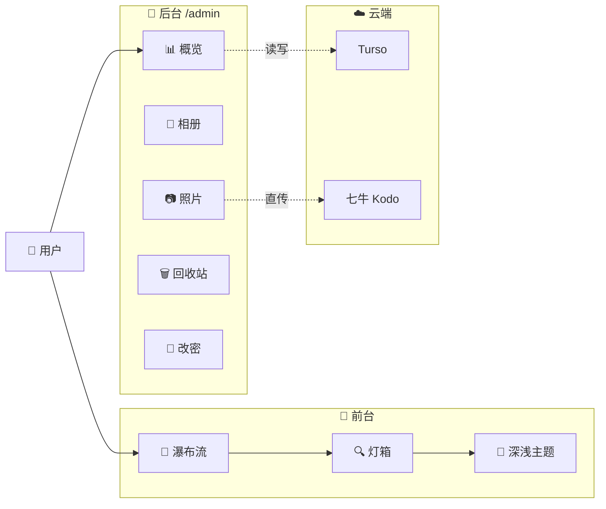
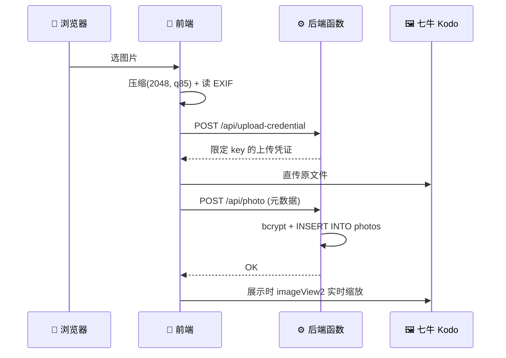

<div align="center">

<picture>
  <source media="(prefers-color-scheme: dark)" srcset="https://img.shields.io/badge/人间快照-Photo%20Memoir-F59E0B?style=for-the-badge&labelColor=111827&color=FB923C&logo=ghost">
  <source media="(prefers-color-scheme: light)" srcset="https://img.shields.io/badge/人间快照-Photo%20Memoir-0EA5E9?style=for-the-badge&labelColor=0EA5E9&color=F8FAFC&logo=ghost">
  
</picture>

<br>

<picture>
  <source media="(prefers-color-scheme: dark)" srcset="https://img.shields.io/badge/一个把生活过成胶片的小项目-EAB308?style=flat&labelColor=1F2937&color=000000">
  
</picture>

<br>

`React 19` · `Vite 6` · `Tailwind 4` · `EdgeOne Pages` · `Turso (libSQL)` · `七牛 Kodo` · `bcrypt` + `JWT`

<br>

[](https://github.com/xiaoleng-ros/Travel/actions/workflows/ci.yml)
[](https://nodejs.org)
[](https://vitejs.dev)
[](https://react.dev)
[](https://developer.mozilla.org/en-US/docs/Web/JavaScript)
[](#)

</div>

---

## 📖 关于项目

**人间快照** 是一个自用的照片回忆录：前台**瀑布流**浏览、灯箱查看、深浅色切换；后台管理**相册 / 照片 / 回收站 / 密码**。

它把"个人云盘"和"电子相册"缝在了一起，但把云端的活全部外包给 **EdgeOne Pages + Turso + 七牛**，本地代码只剩一个前端 + 一个后端函数。

> 💡 之所以走 Serverless：EdgeOne 函数没有持久文件系统、请求体上限 6MB，所以图片改走浏览器直传七牛、缩略图交给 `imageView2`、元数据存云数据库。

---

## ✨ 功能一览

<div align="center">



</div>

### 🌐 前台

- 🌊 **瀑布流** 无限滚动加载，照片按 **拍摄时间** 排序（EXIF 优先，回退上传时间）
- 🔍 **灯箱**：大图 + 左右翻页 + 键盘 `←` `→` `Esc`
- 🎨 **深浅色主题**一键切换，跟随系统偏好
- 🚫 **404 页** 覆盖未匹配路径，杜绝白屏

### 🛠️ 后台（`/admin`）

| 模块 | 说明 |
|------|------|
| 📊 概览 | 相册数、照片数、最近照片、相册分布、最近动态 |
| 📁 相册管理 | 新建 / 删除 / 进入相册管理照片 |
| 📷 照片管理 | 拖拽批量上传、编辑标题描述、**拖拽排序**、单张或批量删除 |
| 🗑️ 回收站 | 恢复 / 彻底删除 |
| 🔑 修改密码 | 改密后 **所有设备 token 立即失效** |

---

## 🧰 技术栈

<div align="center">

| 层 | 选型 |
|----|------|
| 🎨 前端 | React 19 · React Router 8 · Vite 6 · Tailwind CSS 4 |
| ✨ 动画/图标 | [motion](https://motion.dev) · [Phosphor Icons](https://phosphoricons.com) |
| 🖼️ EXIF | [exifr](https://github.com/milianw/exifr)（按需动态加载，仅上传时使用） |
| 🔌 请求 | axios |
| ⚙️ 后端 | Express 4（单文件自包含）|
| 🗄️ 数据库 | libSQL / Turso |
| 🖼️ 图片 | 七牛 Kodo + `imageView2` |
| 🔐 认证 | jsonwebtoken + bcryptjs + cookie-parser |
| 🚦 安全 | express-rate-limit · express-validator |
| 🔑 签名 | `node:crypto` 自实现 HMAC-SHA1，**不依赖七牛 SDK** |

</div>

---

## 🚀 快速开始

### 环境要求

- **Node.js 20 LTS+**（Windows 10/11 实测）
- 网络能访问 `turso.io`（可选）和 `qiniup.com`（可选）——不填也能跑，只是上传功能会降级

### 一键安装

```powershell
# Windows PowerShell
cd d:\Gcodeprojects\Travel
npm install
```

### 配置环境变量

```powershell
Copy-Item .env.local.example .env.local
# 然后编辑 .env.local，填入 JWT_SECRET、七牛凭证（可选）
```

> 💡 生成强随机 JWT_SECRET：
> ```powershell
> node -e "console.log(require('crypto').randomBytes(48).toString('hex'))"
> ```

### 启动开发服务器

```powershell
# 终端 1：后端（端口 3001，未配 Turso 时自动使用 ./api-dev.db）
npm run dev:api

# 终端 2：前端（端口 5173，代理 /api → 3001）
npm run dev
```

访问：<kbd>http://localhost:5173</kbd>

### 首次登录

- 后台：<kbd>http://localhost:5173/admin</kbd>
- 用户名：`admin`
- 密码：如果没配 `ADMIN_INITIAL_PASSWORD`，**首次启动时后端会自动生成 16 位强随机密码并打印到终端**（包含大小写 + 数字 + 特殊字符）
- 🔒 登录后**请立即**在后台修改密码

---

## ⚙️ 环境变量

| 变量 | 必填 | 说明 |
|------|:---:|------|
| `JWT_SECRET` | ✅ | JWT 密钥，建议 48+ 字节随机十六进制 |
| `ADMIN_INITIAL_PASSWORD` | 🟡 | 首次启动时的管理员初始密码；不填则**自动生成随机强密码**并打印到控制台 |
| `FRONTEND_URL` | 🟡 | 前端地址，多个用逗号分隔（CORS 白名单） |
| `TURSO_URL` | 🟡 | Turso 数据库 URL；不填则本地降级为 SQLite 文件 `./api-dev.db` |
| `TURSO_AUTH_TOKEN` | 🟡 | Turso 鉴权 token |
| `QINIU_BUCKET` | 🟡 | 七牛 Kodo 空间名 |
| `QINIU_REGION` | 🟡 | 七牛区域，如 `z0` / `z1` / `z2` / `na0` / `wa0` |
| `QINIU_ACCESS_KEY` | 🟡 | 七牛 AK |
| `QINIU_SECRET_KEY` | 🟡 | 七牛 SK |
| `PORT` | 🟢 | 后端端口，默认 `3001` |

---

## 🏗️ 项目结构

```
Travel/
├── src/                          # 🎨 前端源码
│   ├── admin/                    # 🔐 后台页面（8 个组件）
│   │   ├── AdminDashboard.jsx    #     📊 概览
│   │   ├── AlbumManage.jsx       #     📁 相册管理
│   │   ├── PhotoManage.jsx       #     📷 照片管理
│   │   ├── RecycleBin.jsx        #     🗑️ 回收站
│   │   ├── ChangePassword.jsx    #     🔑 修改密码
│   │   └── ...                   #     RequireAuth / AdminLogin / AdminLayout
│   ├── components/               # 🌐 前台组件
│   │   ├── AlbumListPage.jsx     #     🌊 瀑布流主页
│   │   ├── PhotoGrid.jsx         #     网格布局
│   │   ├── PhotoItem.jsx         #     单张照片
│   │   ├── Lightbox.jsx          #     🔍 灯箱
│   │   ├── ThemeToggle.jsx       #     🎨 主题切换
│   │   └── NotFound.jsx          #     🚫 404
│   ├── context/                  # 🔁 ThemeContext（深浅色状态）
│   ├── icons/                    # 🖼️ 图标
│   ├── api/real.js               # 🔌 接口封装（含七牛直传三步）
│   ├── utils/                    # 🧩 工具函数
│   │   ├── compress.js           #     浏览器端压缩（最长边 2048，q85）
│   │   ├── photoMeta.js          #     EXIF 读取
│   │   ├── upload.js             #     上传前校验
│   │   ├── masonry.js            #     瀑布流布局
│   │   ├── password.js           #     密码强度校验
│   │   └── title.js              #     标题清洗
│   ├── App.jsx                   # 🧭 路由
│   ├── main.jsx
│   └── index.css
├── cloud-functions/              # ☁️ EdgeOne 后端
│   └── api/[[default]].js        #     Express 单文件应用
├── scripts/
│   ├── dev-server.mjs            # 🚦 本地开发入口（读 .env.local → 起 Express）
│   └── set-admin-password.mjs    # 🔑 紧急改密脚本（独立于后端，直连 libSQL）
├── public/                       # 静态资源（logo / favicon）
├── .github/workflows/ci.yml      # 🤖 CI（构建 + 语法检查）
├── edgeone.json                  # EdgeOne Pages 配置
├── .env.local.example            # 环境变量模板
├── .gitignore
├── package.json
└── vite.config.js                # Vite 配置（含 /api 代理）
```

---

## 🖼️ 图片处理流水线

<div align="center">



</div>

- 📐 **压缩**：前端 Canvas 压到最长边 2048px、质量 85（与 `sharp` 效果接近）
- 🖼️ **展示图**：`?imageView2/2/w/2048/h/2048/q/85`
- 📱 **缩略图**：`?imageView2/2/w/640/h/640/q/80/format/webp`
- 🎞️ **GIF** 用原文件（`imageView2` 会丢动画）
- 🔁 **失败重试**：直传失败自动重试 3 次（跨国链路波动大）
- 📏 **上限**：单张 ≤ 20MB，单次 ≤ 20 张（由凭证 `fsizeLimit` 服务端强制）

---

## 🔒 安全设计

| 维度 | 方案 |
|------|------|
| 🔑 **密码存储** | bcrypt（10 轮），客户端 SHA-256 预哈希 → 服务端 bcrypt 二次哈希（新旧兼容）|
| 🌐 **传输** | JWT + `httpOnly` Cookie（`sameSite=strict`），无 token 泄漏到 localStorage |
| 🚫 **改密失效** | `password_changed_at` 字段；旧 token 立即作废（含其他设备）|
| 🚦 **限流** | 登录 5/15min · API 500/15min · 上传 20/15min |
| 📥 **上传凭证** | 精确到单个对象 key，禁止覆盖（`insertOnly: true`），按文件名白名单校验 |
| 📤 **公开接口** | 字段白名单，不暴露 `storage_key` 等敏感字段 |
| 🗑️ **删除** | 软删除 → 回收站 → 彻底删除时才移除云端对象 |
| 🔍 **默认密码** | 若未配 `ADMIN_INITIAL_PASSWORD`，自动 `crypto.randomInt` 生成 16 位强密码 |

---

## 🧪 常用命令

```powershell
npm install              # 安装依赖
npm run dev              # 启动前端（5173）
npm run dev:api          # 启动后端（3001）
npm run build            # 构建到 dist/
npm run preview          # 预览构建产物
npm run dev -- --host    # 局域网访问（Windows 需放行 5173）
```

---

## 🚀 部署

### 生产环境（推荐）

用 **EdgeOne Pages**：

1. 在腾讯云 EdgeOne 控制台创建 Pages 项目，绑定本仓库
2. 构建命令：`npm install && npm run build`
3. 输出目录：`dist/`
4. 后端函数：`cloud-functions/api/[[default]].js`
5. 配置环境变量（见上文表格）
6. 域名绑定 + HTTPS

### 本地生产预览

```powershell
npm run build
npm run preview
```

---

## 📁 项目清理历史

| 提交 | 内容 |
|------|------|
| `9bd5d73` | ♻️ 移除冻结旧后端 `server/` + 一次性迁移脚本（-6152 行）|
| `f887ee6` | 📝 删除冗余方案文档（DEPLOY / IMPROVEMENTS / REVIEW）|
| `5a68b27` | 🐛 修复 CI 路径错误 + 默认密码改为随机生成 |
| `ad71035` | ♻️ 移除前端测试文件及 CI 测试步骤 |

---

## 🧩 已知取舍

- ❌ 没有单元测试：本项目是自用项目，回归风险由人工验证 + 代码审查覆盖
- ❌ 无 SSR：前端 SPA + `react-router` v8 client-side，SEO 不是目标
- ❌ 无 i18n：只有中文
- ❌ 无 TypeScript：全 JS + JSDoc，追求上手速度

---

<div align="center">

<br>

### 🛠️ 由 <b>xiaoleng-ros</b> 亲手搭建

用一杯咖啡 ☕ 的时间，把自己生活里散落在各处的照片收进来。

<br>

<sub>本项目为个人自用，代码不对外提供商业支持。若你想做类似的事，欢迎参考本仓库的架构思路。</sub>

</div>
